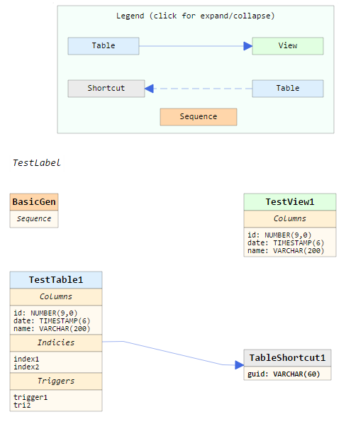

# DbDiagrams
  Simple JS library for visualization database structure.
  Based on JointJS library.
  
  For build use <b>npm</b> ang <b>gulp</b> commands:
  ```sh
    npm install
    gulp
  ```
  Output folder <i>test</i> contains copy of dist and test page (<i>/test/html/index.html</i>).
  
  If everything is OK you should get something like that:
  
  <p align="center">
  
  </p>
